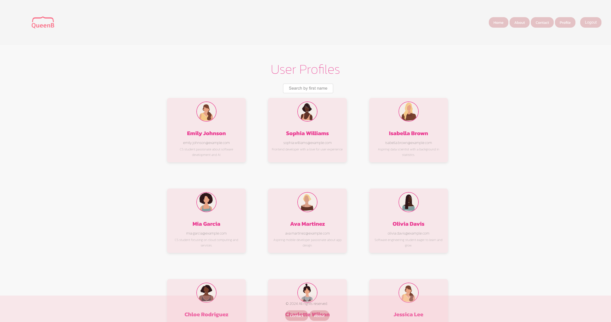
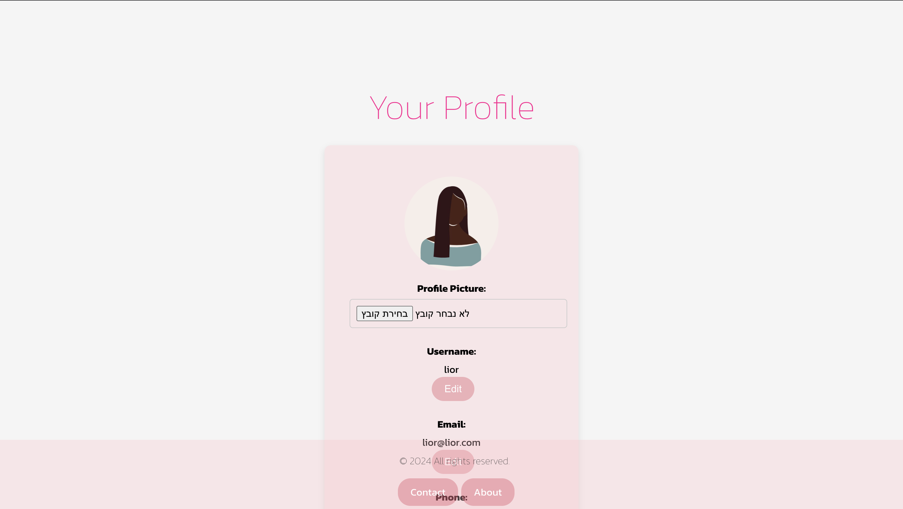
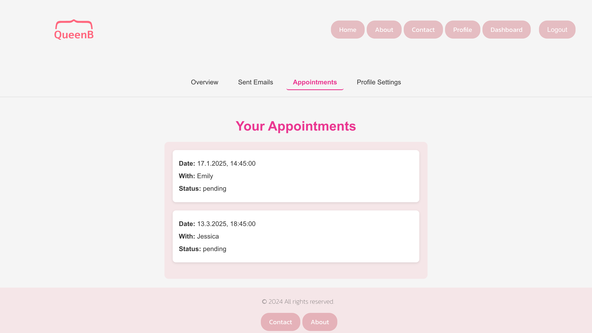

# Queens Match - Community Mentorship App

## 📚 Project Overview
**Queens Match** is a community-driven mentorship application designed to connect mentors and mentees in the tech community. The app empowers individuals to foster meaningful connections, share knowledge, and grow together in programming and tech-related fields.

Users can search for mentors, apply to become mentors, and schedule mentorship sessions. This project aims to bridge the gap between professionals and aspiring developers, creating a collaborative and inclusive environment.




---

## 🌟 Features
- **Mentor Profiles**:
   - View a list of available mentors with details such as their skills, name, email, phone number, and social media links.
  

- **User Registration**:
   - Sign up as a mentor or mentee, filling in details such as name, email, LinkedIn, programming languages, and more.
- **Login & Authentication**:
   - Secure user login with username/password using JWT-based authentication.
- **Appointment Scheduling**:
   - Schedule mentorship sessions with mentors and track them within your dashboard.
- **Mentee Dashboard**:
   - View a personalized dashboard with upcoming appointments and sent emails.


---

## 🚀 Future Features
- **Advanced Search & Filters**:
   - Search for mentors by name, technology stack, and filter by programming languages or other criteria.
- **Feedback System**:
   - A mechanism for mentees to provide feedback and rate mentorship sessions.
- **Automated Thank-You Messages**:
   - Automatically send thank-you notes to mentors after a completed session.
- **Admin Dashboard**:
   - Tools for community administrators to manage users, oversee mentor-mentee activities, and generate detailed reports.
     


---

## 🛠️ Tech Stack
| **Technology**      | **Purpose**                             |
|----------------------|-----------------------------------------|
| [React](https://reactjs.org/)          | Frontend UI Framework                     |
| [Node.js](https://nodejs.org/)         | Backend Runtime Environment               |
| [PostgreSQL](https://www.postgresql.org/) | Relational Database                       |
| [JWT](https://jwt.io/)                 | Secure Authentication                     |
| [Docker](https://www.docker.com/)      | Containerization for Application Deployment |
| [Nodemailer](https://nodemailer.com/)  | Email Service for Appointment Notifications |

---

## 📖 Installation

### Prerequisites
- Install [Node.js](https://nodejs.org/)
- Install [PostgreSQL](https://www.postgresql.org/)
- Optionally, install [Docker](https://www.docker.com/) for containerized deployment.

### Steps
1. **Clone the repository:**
   ```bash
   git clone https://github.com/your-username/queens-match.git
